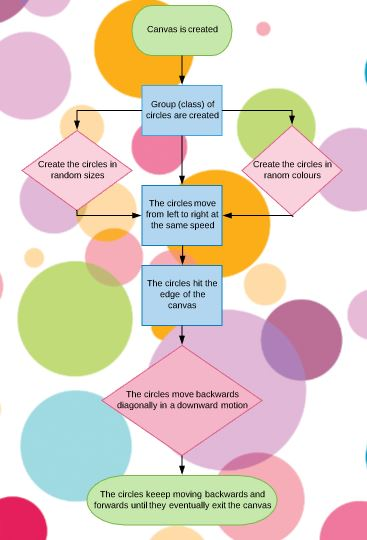
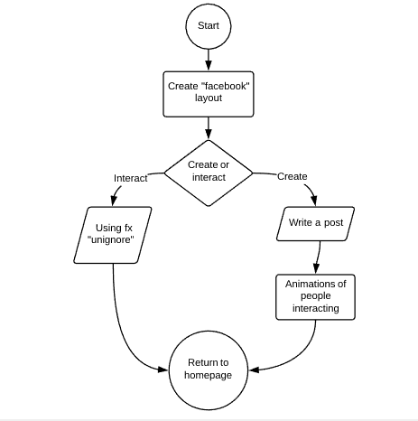

# miniex9

Individual flowchart 

I chose to make a flowchart based on my miniex6  because I found that to be the most complex one. Others might not think that. But I find it complex because it is much more complicated than it looks and I spent a lot of time making it (with a lot of help). I chose to make a flowchart that represents what you can actually see. My flowchart just describes it more literally. 

Link to miniex6; 
https://cdn.rawgit.com/CathrineVilain/Miniex6/c0182eef/p5/empty-example/index.html

The most difficult thing about the flowchart was to decide which angle I wanted to work from. I could have made the flowchart based on the actual code. Although then it would have to be much more technical. And you can't really understand the code if you don't understand the concept of the program, so I found that it made sense to start with the simple angle.  

Group flowcharts 

Before we could make the flowcharts we had to agree on some ideas. After a lot of brainstorming and discussion we ended up with a lot of good ideas but we decided upon these two; 

       

