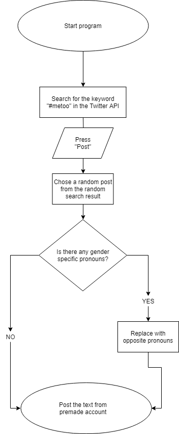

# miniex9

Individual flowchart 

I chose to make a flowchart based on my miniex6  because I found that to be the most complex one. Others might not think that. But I find it complex because it is much more complicated than it looks and I spent a lot of time making it (with a lot of help). I chose to make a flowchart that represents what you can actually see. My flowchart just describes it more literally. 

Link to miniex6; 
https://cdn.rawgit.com/CathrineVilain/Miniex6/c0182eef/p5/empty-example/index.html

The most difficult thing about the flowchart was to decide which angle I wanted to work from. I could have made the flowchart based on the actual code. Although then it would have to be much more technical. And you can't really understand the code if you don't understand the concept of the program, so I found that it made sense to start with the simple angle.  

Group flowcharts 

Before we could make the flowcharts we had to agree on some ideas. After a lot of brainstorming and discussion we ended up with a lot of good ideas but we decided upon these two; 

Twitter API bot 

This program is based on twitters API. The plan is to make a twitter bot using twitters API. The bot itself appears as a twitter profile of a white male. The bot uses twitters API to find posts with the #metoo. It searches for the tweet and when it finds one it changes the pronouns (if the tweet contains pronouns) to male pronouns. The idea behind this idea is to investigate how biased we are when it comes to gender. Will the posts by our twitter bot be discredited because they are posted by a white male or will they be validated?   

In terms of the technical we don't really know how we would make the program yet, But the first thing is definitely getting the twitter API (if we can). But I think making the bot itself will be very complicated. We talked about making a program in p5 that directs you to the twitter profile and the program somehow has to control the twitter profile. Other than that we don't know how to make it work. 

       

Ignore and be ignored 

This program is based on facebook, but in our program we dont want to copy the facebook interface. We'll simply mimic a lookalike interface (just use some blue and the same typography - easy). The program allows you to interact and create posts. After you create a post you will get notifications. But these notifications are not the kind of notifications you are accustomed to. You will get notifications like "no one likes this" and "... people ignored your post (scrolled by)". When you interact you can chose to scroll past post or you can hit the unignore button. 

We came up with this idea because we thought about how much data facebook actually collects. They know everything that everyone does. They just show us the parts that they want us to see. They know exactly how many posts you look at and how many you scroll by and even how long you look at a certain page. We thought it could be really interesting to see how facebook would change if they chose to show different information. Would the "unignore" button guilt you into pressing it on everything your friends post? 

We imagine that we wont need an API or JSON file for this program. It will probably be based on if and else statements, buttons, and visuals.  

Difference from the indivual flowchart 

The two above flowcharts are different from my own flowchart, beacuse rather than explaining an already excisting concept, they explain an idea. They could be used to pitch a idea. Here the flowcharts are much more essential because they are all there is at this point. So the role of the flowcharts are entirely different. 

The concept of algorithms from flowcharts as a wider cultural context 

Flowcharts help us to explain conecepts that are hard to understand just by looking at them. A flowchart breaks down the components/concepts of an algorithm and explains it in a way that is easier to grasp. Rather than seeing the program in itself, you see all the individual parts and processes that construct the program. Algorithms are made up of rules that allows it to operate in a certain way. These rules can be compared to the rules of a culture. A culture is made up of norms, rules, traditions, and conventions that make it a certain way. In a way an algorithm actually is a type of culture. Algorithms can be highly influenced by culture as the data it collects/processes comes from a certain place. "By learning to interpret the container, the inputs and outputs, the seams of implementation, we can begin to develop a way of reading algorithms as culture machines that operate in the gap between code and culture" (Ed Finn "what is an algorithm"). This quote explains how algorithms and culture are intertwined. Algorithms can be machines that serves us. Forexample apps and websites can be tailored to either appeal to a certain culture or promote/create a certain culture. If you look at dating services forexample... There are very conventional dating sites that try to mimic excisting cultural dating processes (for example arranged marriage dating sites).  And then there are sites like tinder that has completely deconstructed the dating process. This might be a bit far fetched, but I just find it interesting how algorithms can either maintain or entirely change how we do things in our daily life. 

